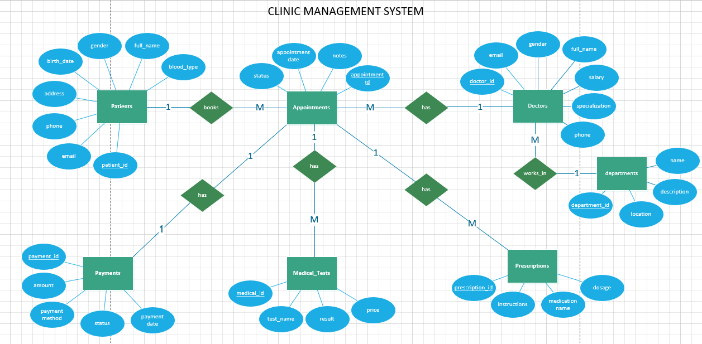

# 🏥 Hospital Management System

## PostgreSQL Clinic Database Design

---

# 📌 Project Overview

This project is a **Hospital Management System** built using **PostgreSQL**.

It is designed to manage:

- Patients
- Doctors
- Departments
- Appointments
- Medical Tests
- Prescriptions
- Payments

The system follows **relational database design principles** with strong normalization and proper relationships between tables.

---

# 🎯 Project Goals

- Manage hospital operations efficiently
- Store patient medical history
- Track doctor schedules
- Handle appointments and payments
- Generate reports and analytics
- Ensure data integrity and consistency

---

# 🧩 Database Structure Overview

The system consists of **7 main tables**:

- departments
- doctors
- patients
- appointments
- medical_tests
- prescriptions
- payments

---

# 🗺️ ERD (Entity Relationship Diagram)

---

# 🔗 Relationships Explanation

## 1. Departments → Doctors (1 : Many)

- One department has many doctors
- Each doctor belongs to one department

---

## 2. Doctors → Appointments (1 : Many)

- One doctor has many appointments
- Each appointment belongs to one doctor

---

## 3. Patients → Appointments (1 : Many)

- One patient can have multiple appointments
- Each appointment belongs to one patient

---

## 4. Appointments → Medical Tests (1 : Many)

- One appointment can include multiple tests
- Each test belongs to one appointment

---

## 5. Appointments → Prescriptions (1 : Many)

- One appointment can generate multiple prescriptions
- Each prescription belongs to one appointment

---

## 6. Appointments → Payments (1 : 1)

- Each appointment has one payment record
- Each payment belongs to one appointment

---

# 🏗️ Tables Description

---

## 📁 departments

Stores hospital departments.

**Fields:**

- id
- name
- description
- location

---

## 👨‍⚕️ doctors

Stores doctor information.

**Fields:**

- id
- full_name
- email
- specialization
- salary
- department_id (FK)

---

## 🧑 patients

Stores patient data.

**Fields:**

- id
- full_name
- gender
- birth_date
- blood_type
- email
- phone

---

## 📅 appointments

Central table connecting doctor and patient.

**Fields:**

- id
- appointment_datetime
- status
- doctor_id (FK)
- patient_id (FK)

---

## 🧪 medical_tests

Stores lab tests.

**Fields:**

- id
- test_name
- result
- price
- appointment_id (FK)

---

## 💊 prescriptions

Stores medications.

**Fields:**

- id
- medication_name
- dosage
- instructions
- appointment_id (FK)

---

## 💳 payments

Stores financial transactions.

**Fields:**

- id
- amount
- status
- payment_method
- payment_date
- appointment_id (FK UNIQUE)

---

# 🔄 System Flow

1. Patient books appointment
2. Doctor assigned to appointment
3. Tests or prescriptions may be added
4. Payment is created for appointment
5. Reports can be generated

---

# 📊 Key Features

✔ Patient management  
✔ Doctor management  
✔ Department organization  
✔ Appointment scheduling  
✔ Medical records tracking  
✔ Financial system  
✔ Reporting system

---

# 📈 Advanced Capabilities (Optional Extension)

- JOIN-based reporting
- Revenue analytics
- Doctor workload analysis
- Patient history tracking
- Monthly financial reports

---

# 🧠 Design Principles Used

- Normalization (3NF)
- Foreign Key Constraints
- One-to-Many relationships
- One-to-One relationships
- Data integrity rules
- Referential integrity

---

# 👨‍💻 Author

Hospital Database Project – Designed for learning and real-world simulation of clinic systems.
